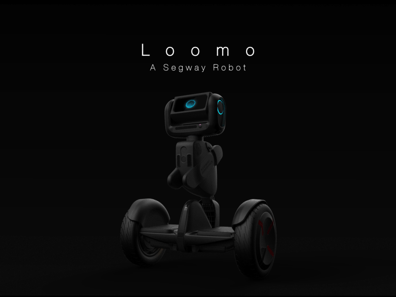

# Loomo App for Autonomous-Driving-Pipeline

   
  

## Description 
This repository presents the code for an Android package running on [Loomo](https://store.segway.com/segway-loomo-mini-transporter-robot-sidekick) from Segway Robotics.

The app is used to connect Loomo (Client) to the server running [Autonomous Driving Pipeline](https://github.com/theoh-io/ROS_Autonomous_Driving). 

The app is based on the template provided by [loomo-algodev](https://github.com/segway-robotics/loomo-algodev) that enables native C++ development of robotics applications on Loomo robot.

## Description

The official Loomo JAVA SDK is targeting Android developers (https://developer.segwayrobotics.com/), which is not friendly to robotics developer that works with C++ or ROS. This kit builds a bridge between JAVA SDK and C++ interfaces (nienbot_algo::RawData, nienbot_algo::AlgoBase, etc..).

The C++ package of the app is located [here](./algo_app/src/main/jni/app_ADP). 

It uses Socket Communication protocol to share information with Server.

### Information Displayed on the screen

* Top Left button: Turn on the App
* A Button: Activate Head Tracking
* B Button: Activate Head + Wheel Tracking
* Start/Stop Algo
* Text displayed: 
    * V/W for linear and angular velocity commands received from server.
    * Depth/Angle: Relative Position of theTarget

## Communications Summary
    - Loomo --> Server
        - Image Transmission: Port(8081)
        ---> Send the Camera Image to the server so that it can be processed
        - State Estimation: Port(8082)
        ---> Send Position Estimation of the Loomo using Built-in  Odometry = Pose (x,y,orientation) and Velocity (linear, angular)
        - Mapping: Port(8083)
        ---> After Receiving bounding box of the target estimates its depth and angle relative to Loomo
        ---> Now Support up to 5 Target for Depth estimation !
        
    - Server --> Loomo
        - Perception 2: Port(8085)
        ---> receive bounding box of the processed detections on server side
        - Control: Port(8080)
        ---> receive Linear and Rotation speed command computed by server

## Debugging
Debugging the app can be tricky hopefully we have some logging tools available.

To enable Logging Debugging messages we first need to activate it by pushing the logAprAlogo.xml file on Loomo sdcard/ folder. One can use the provided script pushAprAlgoLog.bat to automatically ddo that. By default the logging level is set to 3 (meaning that every logging level above will be printed) but can be changed in this file.

To get the Logging we have two solutions. If we run the App with android Studio we can monitor the logging message in Real time using the provided console. Otherwise if we want to analyse the log a-posteriori we just need to pull the file log.txt using the command:  `adb pull sdcard/log.txt `

## Install

The 3rd party library should be downloaded and extracted to **dependency\3rdparty_android**:

https://drive.google.com/drive/folders/1FSVhPz7ZhSJqS4sTjBbKZDFhiEfk5ofH

The installation process of Android Studio and its dependencies can be quite tedious :disappointed_relieved:.

Concerning my Setup I used:
- Android Sudio  (Try using Android Studio version below 4.0)
- Android Gradle Plugin: 3.6.3
- Gradle: 5.6.4
- SDK: API 26 for Android Oreo 8.0

The Project Should be able to build even with the warning messages.

In case you have hard time setting up Android Studio Development environment the app package is also available [APK](algo_app-degub.apk). it can be installed using the command  `adb install -t <name apk>` after having previously connected to Loomo using `adb connect <ip>`

## Dependency 
- Python 
- CMake 

---
## ToDo

- [x] Fix Depth Estimation
- [x] Draw Depth Image + Camera
- [x] Print Control Values
- [x] Print Depth and angle of the Target
- [x] Remove Prediction Socket to avoid duplicate and directly subscribe to mapping socket inside ROS Prediction node
- [ ] Print Emergency Message When Infrared Sensors in range
- [ ] Fix Head Tracking in Pitch
- [ ] Send App Runtime to automatically adapt dt_control in ADP
- [x] Add Possibility to send 5 Depth info in mapping (currently restricted to only 1 target)

